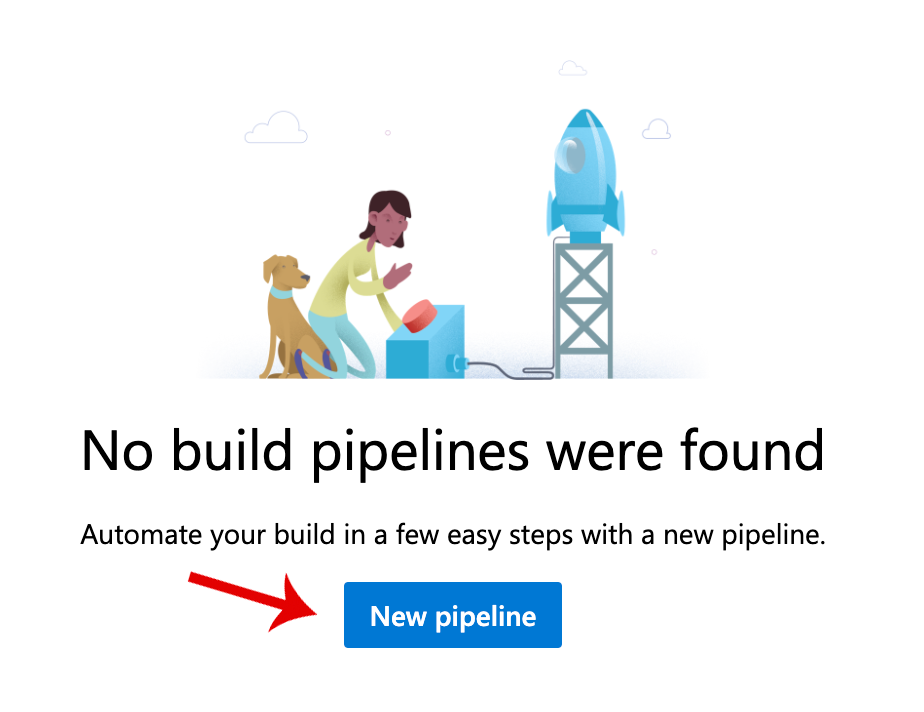

# Configure continuous integration builds for a node.js project hosted in GitHub

Ensuring that your project can be built at all times, and that all your tests
pass, is an important part of maintaining project quality, stability and
velocity.  By introducing a continuous integration build setup, you can
validate that every pull request builds and that the tests pass before it's
even merged.

[Azure Pipelines](https://azure.com/pipelines) provides cloud-hosted build
agents to build your project on Linux, Windows and macOS, for any software
project in any language.  And Azure Pipelines is free for Open Source
projects to build and test their software.

In this lab you will:

- Set up Azure Pipelines to build and test a node.js project hosted in GitHub.
- Customize the build by configuring the YAML build definition.
- Validate pull requests using GitHub Checks and Azure Pipelines

## Prerequisites

* If you don't have a GitHub account, create a free account before you begin.
You can [join GitHub](http://github.com/join) to get started.

* If you don't have a Microsoft account, create a free account before you begin.  You can [create a Microsoft account](https://www.microsoft.com/account) to get started.

## 1. Fork the node.js project

To demonstrate a continous integration build and test setup, we'll use a node.js application with mocha unit tests.  We'll make a copy of this project, or a "fork", into our own GitHub repository so that we can work on it freely, without impacting the original open source  project.

* Open your browser and navigate to [https://github.com/azure-pipelines-demos/node](https://github.com/azure-pipelines-demos/node).

* If you haven't already, sign in to GitHub.

  

  When you've signed in, you'll be returned to the node repository.

* Click Fork in the top right corner of the repository page.

  

* If you are part of any GitHub organizations, you will be prompted to choose where to fork the repository.  Choose your personal GitHub account, on the top of the list.

  

  (If you are not prompted, skip this step.)

* Wait a few seconds while the fork completes.

  

Now, you will be at _your own_ copy of this repository, which is a duplicate of the original repository.  You can work in this repository, commit to it and configure a continuous integration build without impacting the original open source project.

**Have you added the Azure Pipelines app through the GitHub Marketplace?**  If you've added the GitHub app in a prior hands-on-lab, skip to step (4).  But if this is your first hands-on-lab and you have not added the Azure Pipelines app through the GitHub marketplace, then continue to step (2).

## 2.  Enable Azure Pipelines for the repository by adding the GitHub app from the GitHub Marketplace.

* Open the GitHub Marketplace by clicking on Marketplace in the banner at the top of the GitHub page.

  

* In the GitHub Marketplace search box, type "Azure Pipelines"

  

* On the search results page, select "Azure Pipelines"

  

* On the Azure Pipelines application page, scroll down to the bottom of the page.  Then select "Install it for free".

  

* On the confirmation page, select "Complete order and begin installation".

  

* On the installation page, provide a final validation that you want to install Azure Pipelines.

  

## 3. Set up an Azure DevOps account

Create a new Azure DevOps account so that you can enable Azure Pipelines for your repository.

* On the new account page, you can give your Azure DevOps organization a custom name or choose the default, which is derived from your GitHub username.

* Set your Project name to "node".

  

* Click Continue, and wait a few seconds while your account is created.

* Once your account is created, you'll need to authorize it so that it can be connected to GitHub.

  

Now you have an Azure DevOps account created, and Azure Pipelines is linked to GitHub so that you can set up continuous integration builds and pull request validation.

Your project was created when you created your Azure DevOps organization, you do not need to create a new one.

**Skip to step 5**.

## 4. Create a new Azure DevOps Project

Since you have already set up Azure Pipelines for an earlier project, you'll need to create a new Azure DevOps project that corresponds to the GitHub repository that you're going to build.

* Navigate to your Azure DevOps account by opening [https://dev.azure.com/](https://dev.azure.com/).

* Create a new project by selecting `+ Create project` at the top right of the window.

  

* Set the project name to "node".  Set the visibility to "public".  Then click "Create".

  

* In the left-hand sidebar, select the Pipelines tab.  In the next page, click "New Pipeline".

  

## 5. Set up your Continuous Integration build definition

Azure Pipelines can examine your repository so that it can try to determine what kind of software project you're building.  It can then suggest a build definition to build and test your software project.  For basic projects, these definitions are often adequate, and for more complex projects, they serve as a good starting point.  You'll need to select the repository that you want to build to get started.

* Select the repository that you want to build.  This will be the `node` repository that you forked in step 1.  (It should be at the top of the repository list.)

  

* Azure Pipelines will now analyze your repository to determine what language is it, and how it should build it.  Once it's finished with the examination, it will present you with some choices.  Select "node.js" from the options.

  

* Now, Azure Pipelines will show you the build definition.  Build definitions are written in the YAML language and checked in to the repository, right next to the code they build.  This is a technique called "configuration as code" and is helpful since it versions the steps to build the code alongside the code itself.

  You can scroll through the YAML to see how your project will be built.  First, a trigger is set up so that the build will be automatically executed when there's a new push to the master branch, or a pull request is opened against it.

  Next, the pool is set up.  This build will run on the `ubuntu-latest` pool, which indicates that it will run on Azure Pipelines' cloud-hosted macOS build agents.

  Then the build steps are defined: the default steps only restore the dependencies with npm and then perform a build.  We want to update these steps to run our unit tests as well, and to publish test results and code coverage to Azure DevOps.

  Rewrite the entire YAML file, the complete contents should be:

  ```
  trigger:
  - master

  stages:
  - stage: build
    displayName: 'Build'
    jobs:
    - job: ci
      displayName: 'CI'
      pool:
        vmImage: 'ubuntu-latest'
      steps:
      - task: NodeTool@0
        inputs:
          versionSpec: '10.x'
        displayName: 'Install Node.js'

      - script: |
          npm install
          npm run build
          npm run test
        displayName: 'npm install, build and test'

      - task: PublishTestResults@2
        displayName: 'Publish Test Results'
        condition: succeededOrFailed()
        inputs:
          testResultsFiles: 'out/test-results.xml'

      - task: PublishCodeCoverageResults@1
        displayName: 'Publish Code Coverage Results'
        inputs:
          codeCoverageTool: 'cobertura'
          summaryFileLocation: 'coverage/cobertura-coverage.xml'
  ```

* Once you've updated your build YAML, click "Save and Run".  Then on the pop-up dialog, click "Save and Run" again.  This will finalize the configuration, checking in the YAML into your repository and queue your first build.

  

Once you've saved your configuration, Azure Pipelines will set up GitHub so that builds are queued for new and pushed into your master branch and new pull requests.  Then Azure Pipelines will start your first build.

## 6. Watch your project build

Now your build will start.  Azure Pipelines will locate a free macOS build agent that is hosted in Azure to perform your build.


You can watch each step as it's being executed, and you can see the build output from each step.  You can click on any step that's being executed, or has completed, to see the detailed line-by-line output.

After about 45 seconds, the job should be complete, and should succeed.  You'll see this indicated by green success check marks next to the job.


You'll also see that the overall status for this build, in the title, will be decorated with a green check mark as well.

You can now review the build output to understand how this project is build, and you can also click the "Tests" tab to see the output from unit tests.  (They're all passing, as we would hope.)


## 7. Create a pull request to your repository

Now that we've set up Azure Pipelines and validated that our builds work correctly and that the tests run, we can see how this is useful for validating pull requests against our project

Let's make a change to the project to see how pull requests are validated.

* Navigate back to your project's repository on GitHub.  You can click on the repository name at the top of the build output page.

  

* In your GitHub repository, click to open the folder named "api".  Then click to open the folder named "controllers".

  Then click to open the file named "arithmeticController.js".

  Then click the pencil on the right side of the controller file's header.  This will let you start editing the controller file.

  

* Scroll to line 14.  Update the line to remove the `+` before the variables.  The line should look like:

  ```
    'add':      function(a,b) { return a + b },
  ```

  This changes the lambda function so that it no longer coerces variables into integers.  (As a result, the unit tests will fail).

* On your GitHub repository, scroll down to the README section (below the files list).  Then click the pencil on the right side of the README's header.  This will let you start editing the README.

  

* Scroll down to the bottom of the page to commit this change.  In the first text field, the commit title, enter "Update unit test".

  Select the radio button that says "Create a **new branch** for this commit and start a pull request."

  

  Then click "Propose file change".

* The next page is the new pull request page.  Simply click "Create pull request".

  

* Now you'll be taken to the new pull request page.  In the middle of this page is the GitHub Checks section.  Immediately upon creating the pull request, this section is yellow while GitHub ensures that there are no conflicts with the master branch in the pull request that you've opened.  Once that is satisfied, the section will turn green.

  A few seconds later, however, the section should turn yellow again.  At this point, Azure Pipelines will queue a build for the pull request branch, to validate the PR.

  

  Eventually, Azure Pipelines will build the pull request branch, and run the unit tests.  Your change, however, broke the unit test and its assertions will fail.  Therefore, the status check will now turn _red_ indicating that there was a failure.

  

Now you've set up a continuous integration build for your node project on GitHub, and you've seen how to customize the build and how it operates on GitHub Pull Requests.

With this pull request validation build setup, you can see how Azure Pipelines helps protect your master branch to ensure that your code builds and your unit tests pass.  When bad code is submitted as a pull request, it will flag that to help protect you and your contributors.

## Resources

You can find out more information about Azure Pipelines at [azure.com/pipelines](https://azure.com/pipelines).
