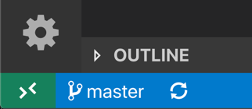
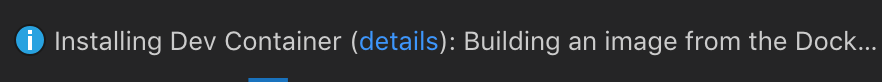
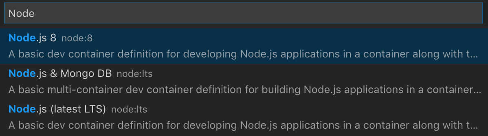

# Remote Development with Visual Studio Code and Docker

The **Visual Studio Code Remote Development** extensions allow you to use a container, remote machine, or the Windows Subsystem for Linux (WSL) as a full-featured development environment. 

In this lab you'll:
- Learn about dev containers, and `devcontainer.json`.
- Clone a repo with a sample project from a language of your choice, and open that inside a dev container in VS Code.
- Move on to another project that doesn't have a `devcontainer.json`, and open that project in a dev container.
- Debug your app running inside the dev container.

## Dev containers

The **Visual Studio Code Remote - Containers** extension lets you use a [Docker container](https://docker.com) as a full-featured development environment. It allows you to open any folder inside (or mounted into) a container and take advantage of VS Code's full feature set. A `devcontainer.json` file in your project tells VS Code how to access (or create) a **development container** with a well-defined tool and runtime stack. This container can be used to run an application or to sandbox tools, libraries, or runtimes needed for working with a codebase.

Workspace files are mounted from the local file system or copied or cloned into the container. Extensions are installed and run inside the container, where they have full access to the tools, platform, and file system. This means that you can seamlessly switch your entire development environment just by connecting to a different container.


This lets VS Code provide a **local-quality development experience** — including full IntelliSense (completions), code navigation, and debugging — **regardless of where your tools (or code) is located**.

## Try a dev container

Let's start out by using a sample project to try things out.

1. Clone one of the sample repositories below.

    ```bash
    git clone https://github.com/Microsoft/vscode-remote-try-node
    git clone https://github.com/Microsoft/vscode-remote-try-python
    git clone https://github.com/Microsoft/vscode-remote-try-go
    git clone https://github.com/Microsoft/vscode-remote-try-java
    git clone https://github.com/Microsoft/vscode-remote-try-dotnetcore
    git clone https://github.com/Microsoft/vscode-remote-try-php
    git clone https://github.com/Microsoft/vscode-remote-try-rust
    git clone https://github.com/Microsoft/vscode-remote-try-cpp
    ```

2. Start VS Code and click on the quick actions Status Bar item in the lower left corner of the window.

    

3. Select **Remote-Containers: Open Folder in Container...** from the command list that appears, and open the root folder of the project you just cloned.

4. The window will then reload, but since the container does not exist yet, VS Code will create one. This may take some time, and a progress notification will provide status updates. Fortunately, this step isn't necessary the next time you open the folder since the container will already exist.

    

5. After the container is built, VS Code automatically connects to it and maps the project folder from your local file system into the container. Check out the **Things to try** section of `README.md` in the repository you cloned to see what to do next - including debugging.

## Open an existing folder in a container

Next we will cover how to set up a dev container for an existing project to use as your full-time development environment.

The steps are similar to those above:

1. Start VS Code, run the **Remote-Containers: Open Folder in Container...** command from the Command Palette, and select the project folder you'd like to set up the container for.

    > In your `user/code` directory, you'll find a folder called `sample-express-app`. Select this folder. If you did the WSL lab, you'll notice this is the same code.

2. Now pick a starting point for your dev container. You can either select a base **dev container definition** from a filterable list. Choose **Node:LTS** for this project.

    

    >Note: You can alos use an existing [Dockerfile](https://docs.docker.com/engine/reference/builder/) or [Docker Compose file](https://docs.docker.com/compose/compose-file/#compose-file-structure-and-examples) if one exists in the folder you selected.

3. After picking the starting point for your container, VS Code will add the dev container configuration files to your project (`.devcontainer/devcontainer.json`). The VS Code window will reload and start building the dev container. A progress notification provides you status updates. Note that you only have to build a dev container the first time you open it; opening the folder after the first successful build will be much quicker.

    

4. After building completes, VS Code will automatically connect to the container. You can now interact with your project in VS Code just as you could when opening the project locally. From now on, when you open the project folder, VS Code will automatically pick up and reuse your dev container configuration.


## Debugging in the dev container

1. Open a new integrated terminal with `Ctrl + Shift '`.
2. Type `npm install` in the terminal to install local packages. 
3. Set a breakpoint (for example, on line 6 of `routes\index.js`). Hit `F5` to begin debugging.

4. Open your web browser to `localhost:3000`, and you'll hit the breakpoint in Visual Studio Code!


## Review

Horray! You've created your own dev container from an existing project, and set it up to be a working development environment, without impacting your local machine configuration.

There are more remote development resources at https://aka.ms/vscode-remote
