# Debug serverless Functions locally with Visual Studio Code, then deploy to Azure

This tutorial walks you through creating and deploying a JavaScript Azure Functions application using the **Azure Functions** extension. Create a new app, add functions and deploy in a matter of minutes from Visual Studio Code.

The Azure Functions extension is used to create, manage, and deploy Functions Apps on Azure. You'll see it on the left side of VS Code by the Azure icon.

## Prerequisite check

Before we continue, ensure that you have all the prerequisites installed and configured.

In VS Code, you should see an email address in the Status Bar and a subscription in the **AZURE FUNCTIONS** explorer.

Verify that you have the Azure Functions tools installed by opening a terminal (or PowerShell/Command Prompt) and running `func`.

```bash
$ func
                  %%%%%%
                 %%%%%%
            @   %%%%%%    @
          @@   %%%%%%      @@
       @@@    %%%%%%%%%%%    @@@
     @@      %%%%%%%%%%        @@
       @@         %%%%       @@
         @@      %%%       @@
           @@    %%      @@
                %%
                %

Azure Functions Core Tools (2.0.1-beta.22)
Function Runtime Version: 2.0.11415.0
```

## Create your local Function App

First, create a local Azure Functions application. An Azure Functions app can contain many Functions with various triggers - this tutorial focuses on HTTP triggers, which allow you to handle to incoming HTTP traffic.

In the Activity Bar, click on the Azure logo to show the **AZURE Functions** explorer and click the **Create Project** icon.

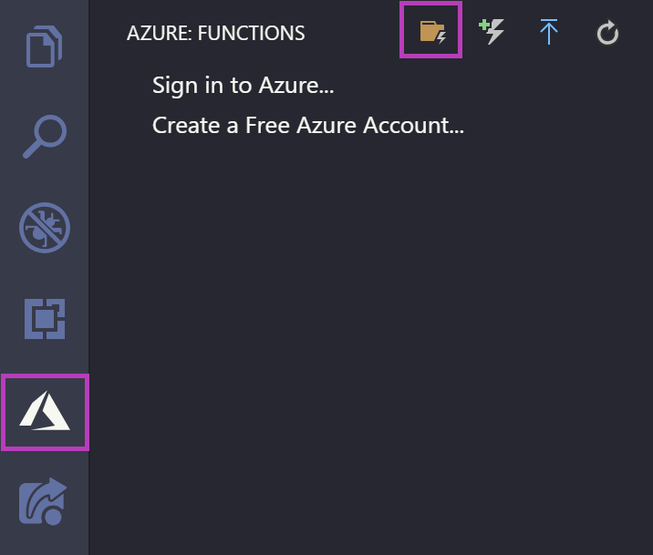

Choose an empty directory for the app then select JavaScript for the language of your Functions App.

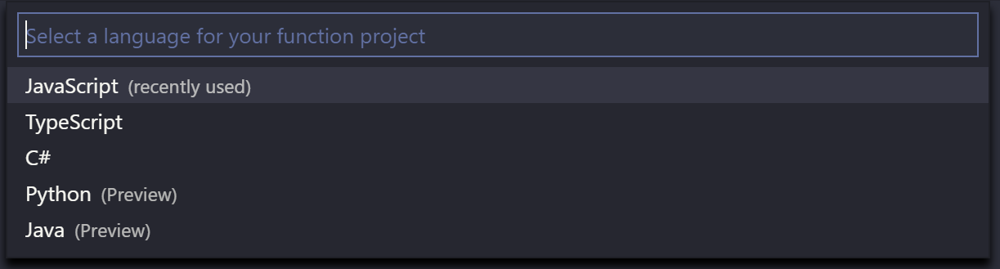

When prompted, choose **Open in current window** and VS Code will reload with your new Functions app in the workspace.

Next, add an HTTP trigger Function to your app.

## Add a Function to your App

Next, create a Function that handles HTTP requests.

From the **AZURE FUNCTIONS** explorer, click the **Create Function** icon.

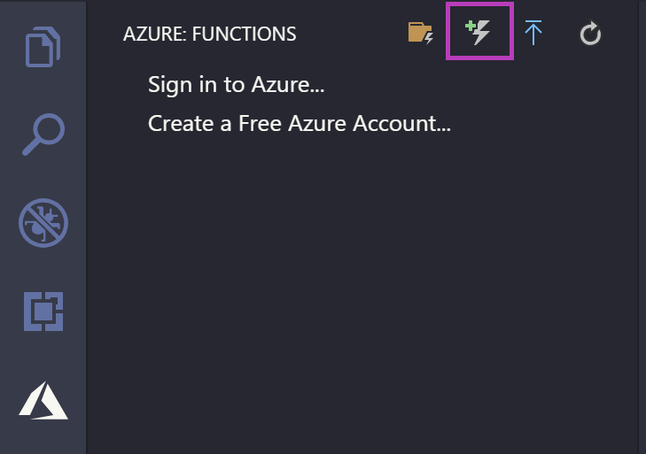

Select the directory you currently have open - it's the default option so press `kbstyle(Enter)`. When prompted, choose HTTP trigger, use the default name of `HttpTriggerJS`, and choose **Anonymous** authentication.

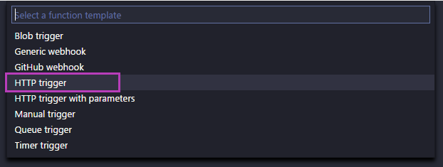

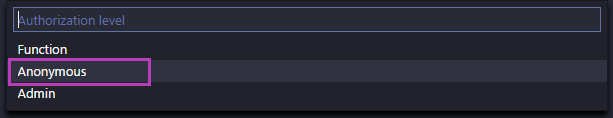

Upon completion, a new directory is created within your Function app named `HttpTriggerJS` that includes `index.js`and `functions.json` files. The `index.js` file contains the source code that responds to the HTTP request and `functions.json` contains the [binding configuration](https://docs.microsoft.com/en-us/azure/azure-functions/functions-triggers-bindings) for the HTTP trigger.

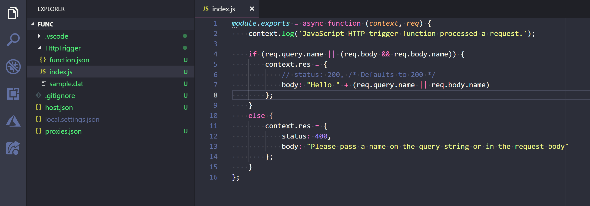

Next, run your app locally to verify everything is working.

## Run and test your App locally

Upon creating the Function application, the necessary VS Code launch configuration was added to your project. To run the project locally, press `F5`. This will launch and attach to the Azure Functions host - this is the same runtime that runs on Azure so you can be sure that your source code runs the same locally as it does when deployed.

Press `F5` to launch the debugger. Output from the Functions Core tools is displayed in the VS Code Integrate Terminal panel. Once the host has started up, the local URL for your Function is written out. `Ctrl+Click` (`Cmd+Click` on macOS) the URL to open it in your browser.

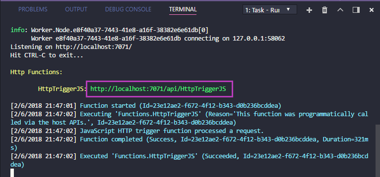

The default HTTP template parses a `name` query parameter to customize the response, add `?name=<yourname>` to the URL in your browser to see the response output correctly.

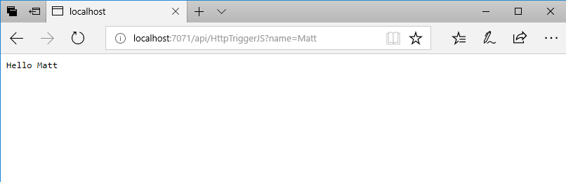

Now that your Function is running locally, make some changes and set a breakpoint to see how Functions works. Learn more about the bindings that are available on [docs](https://docs.microsoft.com/en-us/azure/azure-functions/functions-triggers-bindings#supported-bindings) and keep in mind that all available bindings will run within the Azure Functions extension. This includes triggers from other services such as Azure Storage as seen below.

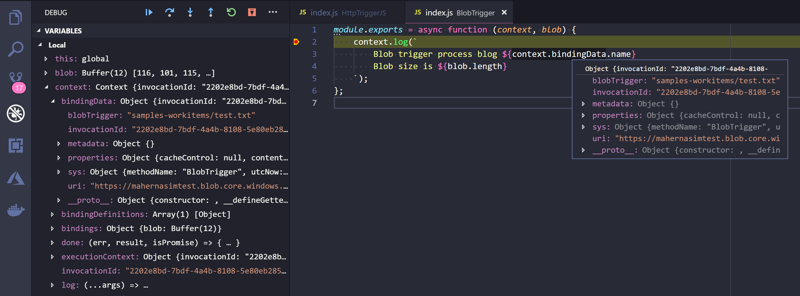

Next, set up your Azure account and publish the Function App from the extension.

## Deploy your App using Azure Functions

In the **AZURE FUNCTIONS** explorer, click the blue up arrow icon to deploy your app to Azure Functions.

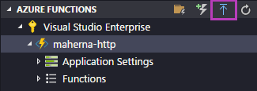

> **Tip:** You can also deploy from the **Command Palette** (`kb(workbench.action.showCommands)`) by typing 'deploy to function app' and running the **Azure Functions: Deploy to Function App** command.

From here follow the prompts. Choose the directory that you currently have open, select your Azure subscription, and then choose **Create New Function App**.

1. Type a globally unique name for your Function App and press `kbstyle(Enter)`. Valid characters for a function app name are 'a-z', '0-9', and '-'.

2. Choose **Create New Resource Group**, type a Resource Group name, like 'myResourceGroup' and press `kbstyle(Enter)`.

3. Choose a location in a [region](https://azure.microsoft.com/en-us/regions/) near you or near other services you may need to access.

4. Choose **Create New Storage Account**, type a globally unique name of the new storage account used by your function app and press Enter. Storage account names must be between 3 and 24 characters in length and may contain numbers and lowercase letters only.

Function app creation starts after you choose your Storage account.

The Output panel shows the Azure resources that were created in your subscription.

> **Tip:** A storage account is not required for HTTP trigger functions, other function triggers (e.g. Storage) do, however, require a storage account.

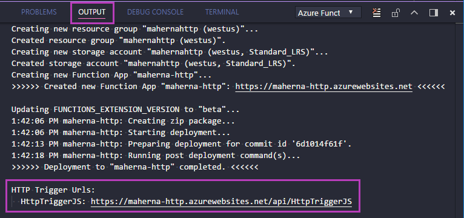

## Browse the website

The Output panel will open during deployment to indicate the status of the operation. Once completed, find the app that you just created in the **AZURE FUNCTIONS** explorer, expand the **Functions** node to expose the HttpTriggerJS function, then right-click and choose **Copy Function Url**. Paste the URL into your browser along add the `?name=Matt` query parameter and press `kbstyle(Enter)` to see the response.

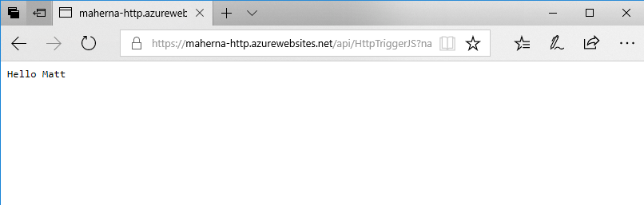

## Updating the App

Next, make some changes to your Function and add new Functions with other Triggers. Once you have all the source code running correctly in your local environment, click the blue up arrow **Deploy to Function App** button to deploy your changes.

> **Tip:** When deploying, the entire Functions application is deploy so changes to all individual Functions will be deployed at once.

## Congratulations!

Congratulations, you've successfully completed this walkthrough! If you're interested in creating your own Azure account, start your free trial at https://azure.com/free.

You'll get $200 in Azure credits to try out any combination of services, in addition to a wide variety of always free services.